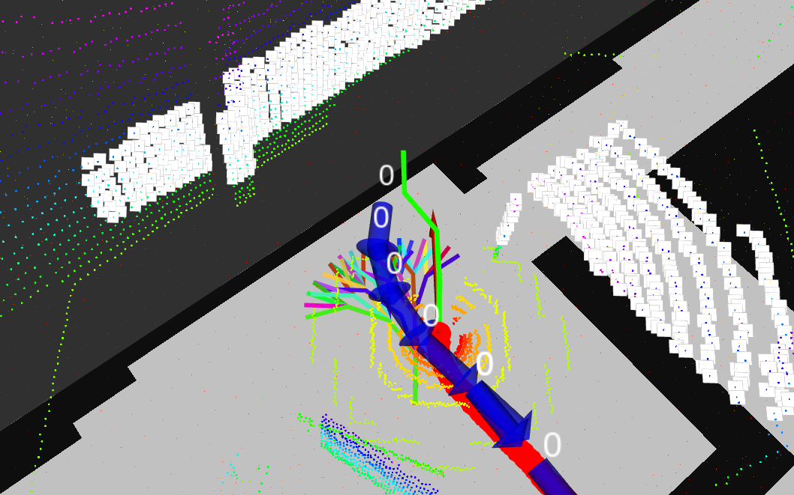

# Path Planning Dynamic
**Author:** Jossue Espinoza <br>

[](https://docs.ros.org/en/humble/)
[](LICENSE)

---

This ROS 2 package implements a complete dynamic path planning pipeline through ROI calculation, point cloud clustering, and a tree-based A* algorithm for path planning.

**NOTE:** this repo was tested on Ubuntu 22.04 LTS, with ROS 2 Humble and Gazebo Fortress (Ignition).

--- 
<p align="center">
  
  <br>
  <em>Robot Path Planning in Real Time with Simulated Lidar</em>
</p>  

> [!IMPORTANT]
> This repository is based on the work of Armando Genis in [navpilot-framework](https://github.com/armando-genis/navpilot-framework).
> **Contact email:** armando_genis@outlook.com
> **GitHub:** https://github.com/armando-genis

## 📚 Table of Contents
- [Installation](#installation)
    - [Pre-requisites](#pre-requisites)
    - [Cloning this Repo](#cloning-this-repo)

- [Processing Pipeline](#processing-pipeline)

- [Configuration](#configuration)
    - [Params Configuration](#params-configuration)
    - [Considerations for Creating HD Maps with Vector Map Builder (.oms)](#considerations-for-creating-hd-maps-with-vector-map-builder-oms)

- [Usage](#usage)


---

## Installation

### Pre-requisites

It is assumed that any distro of ROS 2 is already installed.
To avoid possible errors, please update your system and install the following ROS 2 dependencies.

> [!NOTE]
> You don’t need to modify $ROS_DISTRO; it’s a global environment variable.
> If the command doesn’t work, it probably means your ROS 2 installation is incomplete or not properly sourced.

```bash
sudo apt install \
  # Build tools
  build-essential \
  cmake \
  ros-$ROS_DISTRO-ament-cmake \
  ros-$ROS_DISTRO-rosidl-default-generators \
  ros-$ROS_DISTRO-rosidl-default-runtime \

  # Core ROS 2
  ros-$ROS_DISTRO-rclcpp \
  ros-$ROS_DISTRO-std-msgs \
  ros-$ROS_DISTRO-sensor-msgs \
  ros-$ROS_DISTRO-geometry-msgs \
  ros-$ROS_DISTRO-visualization-msgs \
  ros-$ROS_DISTRO-nav-msgs \
  ros-$ROS_DISTRO-vision-msgs \
  ros-$ROS_DISTRO-polygon-msgs \
  ros-$ROS_DISTRO-image-geometry \
  ros-$ROS_DISTRO-message-filters \

  # TF2
  ros-$ROS_DISTRO-tf2 \
  ros-$ROS_DISTRO-tf2-ros \
  ros-$ROS_DISTRO-tf2-geometry-msgs \

  # Grid map
  ros-$ROS_DISTRO-grid-map-ros \

  # PCL + bindings ROS
  libpcl-dev \
  ros-$ROS_DISTRO-pcl-conversions \

  # OpenCV + Eigen
  libopencv-dev \
  libeigen3-dev \

  # Lanelet2
  ros-$ROS_DISTRO-lanelet2-core \
  ros-$ROS_DISTRO-lanelet2-io \
  ros-$ROS_DISTRO-lanelet2-maps \
  ros-$ROS_DISTRO-lanelet2-projection \
  ros-$ROS_DISTRO-lanelet2-routing \
  ros-$ROS_DISTRO-lanelet2-traffic-rules \
  ros-$ROS_DISTRO-lanelet2-validation

```

### Cloning this Repo

Clone this package inside the `src` directory of your ROS 2 workspace.  
Replace **`colcon_ws`** with the name of your own workspace folder.

```bash
cd ~/colcon_ws/src
git clone https://github.com/armando-genis
cd .. 
colcon build --symlink-install --packages-select path_planning_dynamic --cmake-args -DCMAKE_BUILD_TYPE=Release
source install/setup.bash
```
> [!NOTE]
> This builds the package and sets a symbolic link to the python files (nodes and launch files). With this, re-build every time that a python file is modified, is not required. Also, is safely remove the Release flag, but is recommended for a better performance. <br>
> Whether you see a problem during the `colcon build` related to Eigen, please modify the `CMakeLists.xml`. 

---
## Processing Pipeline

1. **ROI filtering (`pointcloud_roi_node`)**
   - Receives the raw LiDAR point cloud:
     - Input: `/lidar/points` (`sensor_msgs/PointCloud2`) defined in `config/params.yaml`
   - Applies ROI cropping, ground segmentation and optional voxel downsampling.
   - Publishes the filtered clouds:
     - Output (ROI): `/points_rotated`
     - Output (non-ground): `/points_rotated_notground`

2. **Obstacle clustering (`pointcloud_clustering_node`)**
   - Subscribes to the filtered point cloud (typically `/points_rotated_notground`).
   - Performs Euclidean clustering and optional tracking.
   - Publishes detected obstacles as a custom message:
     - Output: `/obstacle_info` (`path_planning_dynamic/ObstacleCollection`)

3. **Path planning (`path_planning_node`)**
   - Subscribes to obstacle information:
     - Input: `/obstacle_info`
   - Builds an obstacle occupancy grid and computes the SDV trajectory along the lanelet2 map.
   - Main outputs:
     - `/occupancy_grid_obstacles` (`nav_msgs/OccupancyGrid`) – obstacle occupancy grid.
     - `/sdv_trajectory` (`nav_msgs/Path`) – selected SDV path.
     - `/all_available_paths` (`visualization_msgs/MarkerArray`) – optional visualization of all candidate paths.
     - `/global_planner` (`visualization_msgs/MarkerArray`) – optional visualization of the best route selected.

## Configuration
### Params Configuration
All parameter values can be configured in `config/params.yaml`, each with a short description.


### Considerations for Creating HD Maps with Vector Map Builder (.oms)
> [!TIP]
> If this is your first time creating HD Maps, you can follow the next tips.
> You can use this website to create your vector map [VECTOR_MAP_BUILDER](https://tools.tier4.jp/vector_map_builder_ll2/).
> This is a short video where you can see how to create a map [Example](https://youtu.be/ej0_aSFr-bo?si=ISVjWjqfLOjZB5Dk).
> Remember to add the center linestring and take care about the direction of your road (The arrows).

When creating a `Lanelet2Map` in the Vector Map Builder, follow these steps to configure the map projection:

- 1. Click on **Change Map Project Info.**
- 2. Select **Set MGRS from Lat/Lon** and input the following coordinates: 
    - **Latitude:** `49`
    - **Longitude:** `8.4`
- 3. Click **Convert** to apply these settings.

> [!NOTE]
>  When exporting the map, you may encounter an error indicating that the component x or y is negative. This error can be safely ignored, as it does not impact the map creation process. Proceed with creating the map even if these errors appear.

when finding black spaces in the rout is because the lack of points you can add points with insert point with linestring

## Usage

First, run the system that publishes your `sensor_msgs/PointCloud2` message (e.g. your LiDAR simulator or real sensor).

Then, in your ROS 2 workspace:
```bash
cd ~/colcon_ws/src
colcon build --symlink-install --packages-select path_planning_dynamic --cmake-args -DCMAKE_BUILD_TYPE=Release
source install/setup.bash
ros2 launch path_planning_dynamic planning.launch.py 
```
